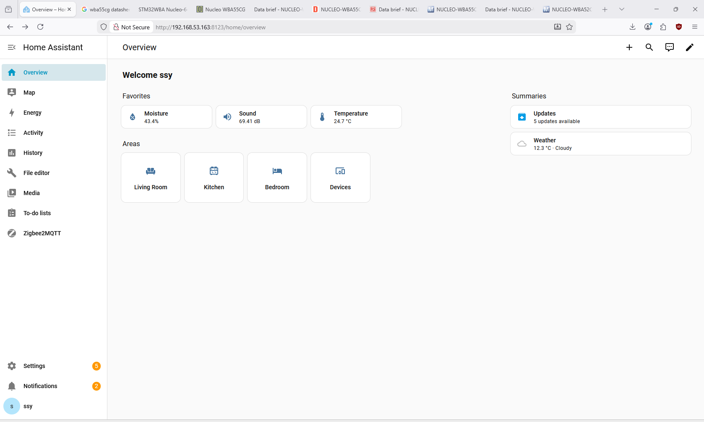
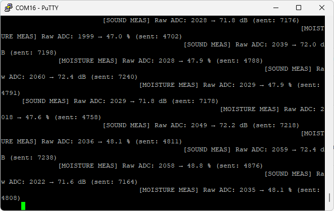
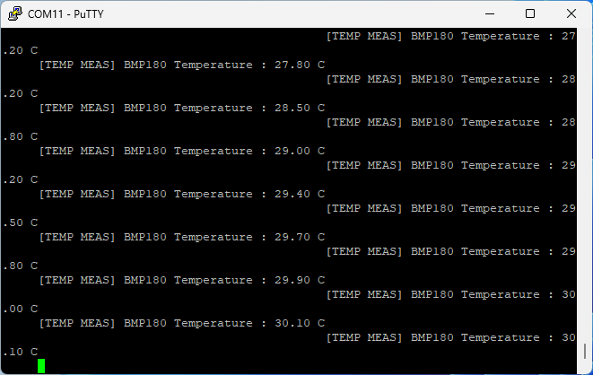
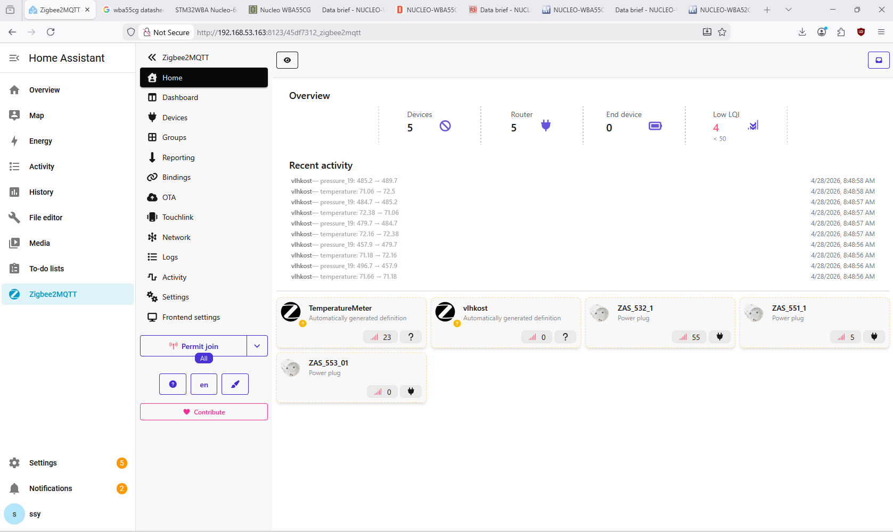
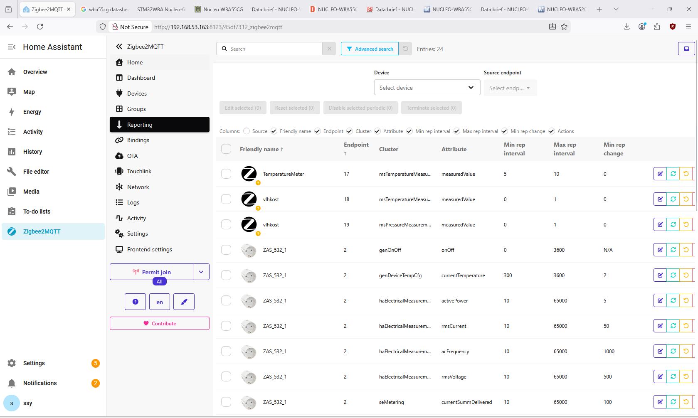
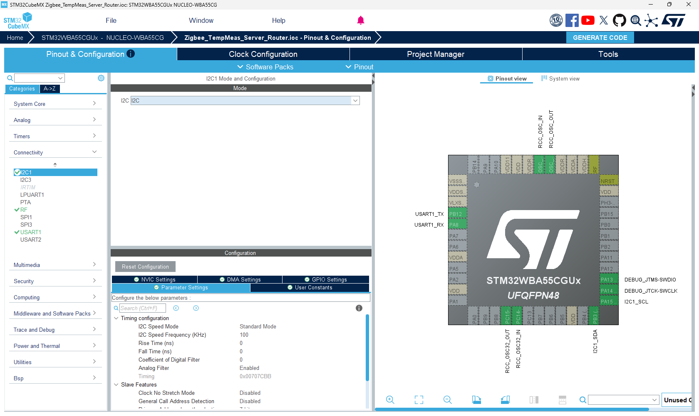
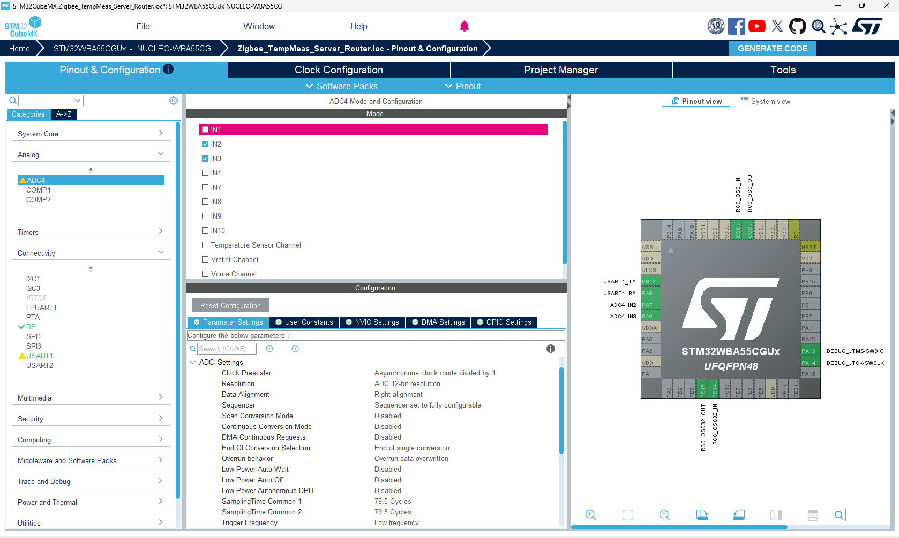
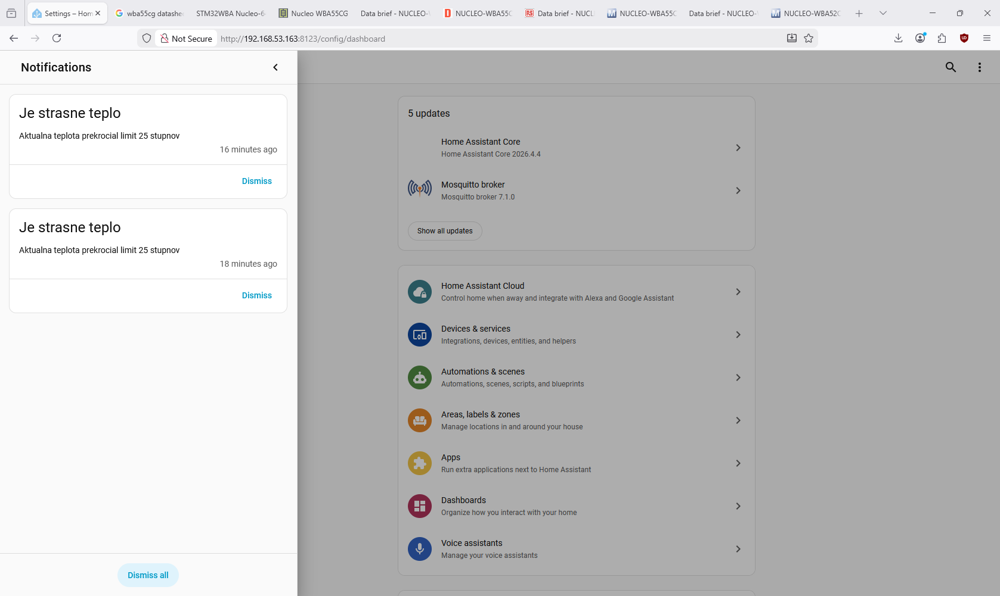

# Dokumentácia projektu MPC-SSY

## Základné informácie
**Predmet:** MPC-SSY  
**Členovia tímu:** Adam Kríž, Filip Frey 

## Popis riešenia
Cieľom tohto projektu je vytvorenie bezdrôtovej senzorovej siete založenej na protokole Zigbee. Systém pozostáva z centrálneho kontroléra (Raspberry Pi) a dvoch koncových zariadení (mikrokontroléry Nucleo-WBA55CG). Kontrolér zhromažďuje fyzikálne veličiny z meracích uzlov a následne ich spracováva v prostredí pre domácu automatizáciu.

### Sieťová architektúra
- **Kontrolér:** Raspberry Pi s nainštalovanou aplikáciou pre domácu automatizáciu (napr. Home Assistant / Zigbee2MQTT).
- **Koncové body:** 2x STM32 Nucleo-WBA55CG s podporou Zigbee protokolu.
- **Komunikačný protokol:** Zigbee.

### Zber dát a hardvérové zapojenie
Meranie fyzikálnych veličín je rozdelené medzi dva mikrokontroléry:
1.  **Mikrokontrolér 1:** Sníma teplotu prostredia pomocou senzora pripojeného cez zbernicu I2C.
2.  **Mikrokontrolér 2:** Sníma hladinu zvuku (v decibeloch) a vlhkosť vzduchu. Tieto senzory sú pripojené na analógové vstupy (ADC) mikrokontroléra.

**Grafické rozhranie (GUI):**
Nižšie je zobrazené rozhranie kontroléra, kde sú v reálnom čase vykresľované namerané hodnoty.

**Schémy zapojenia:**
Nasledujúce obrázky dokumentujú fyzické prepojenie senzorov s mikrokontrolérmi Nucleo.

## Implementácia prenosu dát (Zigbee Clustery)
Z dôvodu špecifických požiadaviek na prenos dát a kompatibilitu sme využili existujúce Zigbee clustery nasledovne:
- **Teplota:** Prenášaná štandardne cez *Temperature Measurement Cluster*.
- **Hladina zvuku (dB):** Prenášaná cez *Temperature Measurement Cluster*. Tento cluster bol zvolený, pretože umožňuje prenos celočíselných hodnôt (Integer), čo vyhovuje nášmu formátu spracovania hluku.
- **Vlhkosť:** Prenášaná cez *Pressure Measurement Cluster* (tlakový cluster).

Hoci toto mapovanie nezodpovedá štandardným sémantickým definíciám Zigbee clusterov, v rámci nášho uzavretého systému je plne funkčné.

**Monitorovanie komunikácie:**
Výpis z konzoly potvrdzujúci úspešné odosielanie dát z mikrokontrolérov:

## Konfigurácia a spracovanie dát
Na strane riadiacej aplikácie (Home Automation) bolo potrebné upraviť konfiguračné súbory pre korektnú interpretáciu prijatých dát. Tieto súbory a nachádzajú v priečinku

> `src/homeAutomation`

Definované boli nové entity, ktoré preberajú surové hodnoty z clusterov a predefinujú ich na správne jednotky:
- Hodnota z tlakového clustera je interpretovaná ako **vlhkosť (%)**.
- Hodnota z druhého teplotného clustera je interpretovaná ako **hluk (dB)**.

Taktiež bolo zmenené hodnoty tzv. Reportingu, ktoré určujú ako často sa kontrolér dopytuje meracích uzlov na výsledky meraní.

## Hardvérová konfigurácia (STM32CubeMX)
Pre správnu funkčnosť periférií na mikrokontroléroch Nucleo-WBA55CG bola vykonaná detailná konfigurácia v nástroji STM32CubeMX. 

### Konfigurácia I2C (Mikrokontrolér 1)
 Pre načítanie dát z teplotného senzora sme využili zbernicu I2C. V CubeMX bol aktivovaný príslušný I2C blok v režime "Standard Mode". Na obrázku nižšie je znázornené priradenie pinov a nastavenie parametrov komunikácie.  
 
### Konfigurácia ADC (Mikrokontrolér 2)
Pre spracovanie analógových signálov zo senzora vlhkosti a hlukového senzora bol nakonfigurovaný ADC prevodník (Analog-to-Digital Converter). Využili sme dva nezávislé kanály s primeranou vzorkovacou frekvenciou, aby sme zabezpečili stabilitu načítaných hodnôt.

 

## Automatizácia
V systéme bola implementovaná logika pre automatizované riadenie inteligentnej zásuvky na základe teploty:
1.  **Podmienka:** Ak teplota v meranom priestore prekročí hranicu 25 °C.
2.  **Akcia 1:** Systém odošle notifikáciu o vysokej teplote.
3.  **Akcia 2:** Automatické zapnutie inteligentnej zásuvky.
4.  **Ukončenie:** Pri poklese teploty pod stanovenú hranicu sa zásuvka automaticky vypne.

Konfiguračný súbor automatizácie sa nachádza v priečinku:

> `src/homeAutomation`

